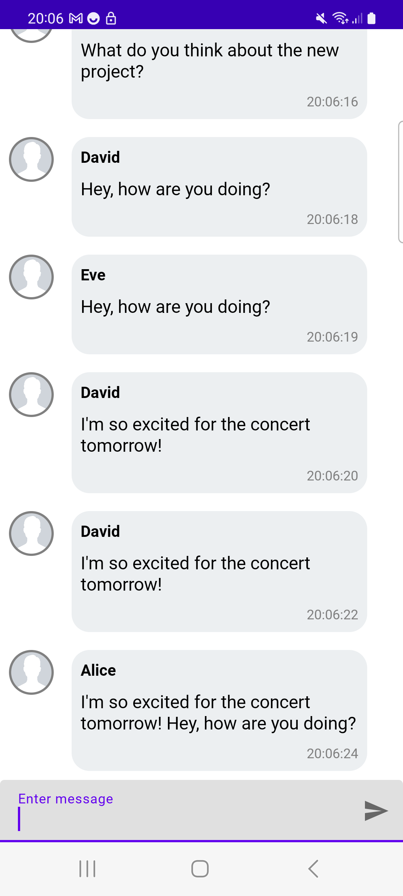
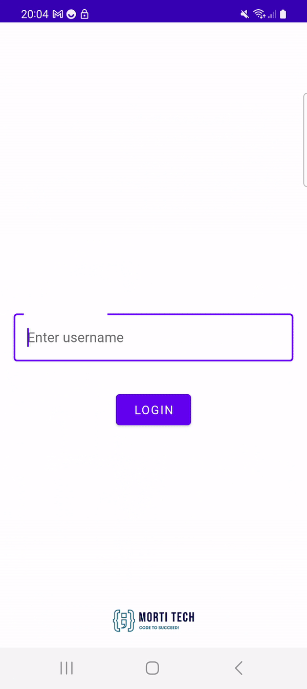

# Kotlin Flow Chat Application
This is an Android chat application built using Kotlin and Kotlin Flow. The application allows users to send and receive messages in a chat room.

  

 

## Features
- Real-time messaging using Kotlin Flow.
- Users can send and receive messages in a chat room.
- Simple user interface with a clean and modern design.

## Dependencies
- Android Architecture Components: ViewModel
- Kotlin Coroutines.
- Kotlin Flow.
- Material Design Components.

## Installation
- Clone the repository to your local machine using `git clone https://github.com/your-username/kotlin-flow-chat-app.git`
- Open the project in Android Studio.
- Build and run the application on an emulator or physical device.

## Usage
- Launch the application.
- Enter a username and click on the login button to enter the chat room.
- Type a message in the text field at the bottom of the screen and click on the send button to send the message.
- Incoming messages will appear in the chat room in real-time.

## Contributing
Contributions to this project are welcome. To contribute, please follow these steps:

- Fork the repository.
- Create a new branch.
- Make your changes and commit them.
- Push your changes to your fork.
- Create a pull request.
- Please ensure that your pull request follows the project's coding style and that it includes appropriate tests.

The Kotlin Flow Chat Application is a great project to learn Kotlin SharedFlow because it demonstrates how to use SharedFlow to build a chat application that supports real-time messaging.
Here are brief explanations of the three main classes in the project:
## ChatRepository
The `ChatRepository` class is responsible for managing the chat messages. It provides methods to send and receive chat messages and exposes a `SharedFlow` of incoming messages. The `incomingMessages` flow emits incoming chat messages as they arrive and can be observed by clients to display the chat history. The `sendMessage` method sends a chat message to the server. It takes a `username` and `content` as input parameters and emits a new `ChatMessage` with `MessageType.OUTGOING`. The `simulateIncomingMessages` method simulates incoming chat messages for testing purposes. It emits a random chat message every 500-2000 milliseconds until a fixed number of messages is reached.

## ChatViewModel
The `ChatViewModel` class is responsible for managing the chat messages and providing an interface for the UI to interact with the chat. It provides a `sendMessage` method to send chat messages and exposes a `SharedFlow` of incoming messages. The `incomingMessages` flow emits incoming chat messages as they arrive and can be observed by clients to display the chat history. The `sendMessage` method delegates to the `ChatRepository` to send the message to the server. The method takes a `username` and `content` as input parameters and forwards them to the repository for processing.

## ChatAdapter
The `ChatAdapter` class is responsible for displaying the chat messages in the `RecyclerView` in the `ChatActivity`. It extends the `ListAdapter` class and implements the `DiffUtil.ItemCallback` interface to efficiently handle changes in the list of chat messages. The `addMessage` method is used to add a new chat message to the list of messages and update the UI.

Overall, this project is a great example of how to use Kotlin SharedFlow to build a real-time messaging feature in an Android application. It demonstrates how to use the `MutableSharedFlow` and `SharedFlow` classes to emit and observe messages, and how to use coroutines to manage concurrency and perform asynchronous operations. It also shows how to use the `ViewModel` architecture component to separate the UI and data layers of the application and how to use the `ListAdapter` class to efficiently handle changes in the list of chat messages.

 

  

 
